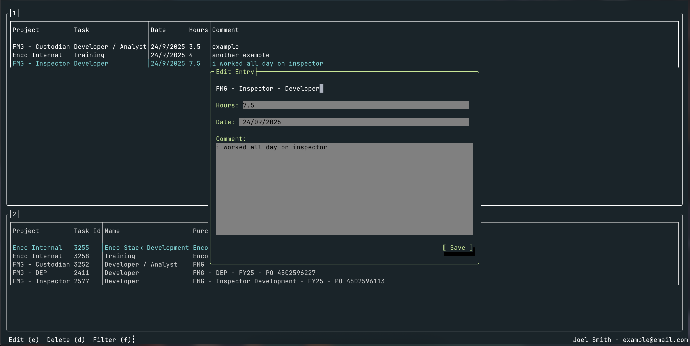

# Chronos CLI

A cross-platform command-line tool for managing your time logging at Enco, now also features a Terminal User Interface (TUI)!.



## Installation

### Prerequisites
- [.NET 8.0 SDK](https://dotnet.microsoft.com/download/dotnet/8.0) or later

### Install from Source

```bash
# Clone the repository
git clone https://github.com/joeldotsmith2004/ChronosCli.git
cd ChronosCli

# Build and install globally
dotnet clean
dotnet build
dotnet pack
dotnet tool install --global --add-source ./nupkg ChronosCli

# Clean up
cd ..
rm -rf ChronosCli
```

### Verify Installation

```bash
chronos --help
```

## Usage

The CLI uses the basic command format of:

```bash
chronos <command> [options]
```

While to use the TUI:
```bash
chronos
```

## Configuration

Chronos CLI stores configuration data in your user profile directory:

- **Windows**: `%USERPROFILE%\.chronos`
- **macOS/Linux**: `~/.chronos`

## Authentication

On first use, Chronos will prompt you to authenticate with your Enco credentials. Your authentication tokens are securely stored using the Microsoft Authentication Library (MSAL).

## Troubleshooting

### Installation Issues

If you encounter installation errors, try:

```bash
# Uninstall any existing version
dotnet tool uninstall --global ChronosCli

# Reinstall
dotnet tool install --global --add-source ./nupkg ChronosCli
```

### Command Not Found

If `chronos` command is not recognized after installation:

1. Ensure the .NET tools directory is in your PATH
2. Restart your terminal
3. Try running with full path: `~/.dotnet/tools/chronos` (macOS/Linux) or `%USERPROFILE%\.dotnet\tools\chronos.exe` (Windows)

## Requirements

- .NET 8.0 Runtime
- Internet connection for Enco API access
- Valid Enco user account


## Support

For issues and questions:
- Create an issue on GitHub
- Contact your Enco administrator

---

*Chronos CLI - Making time tracking effortless*
